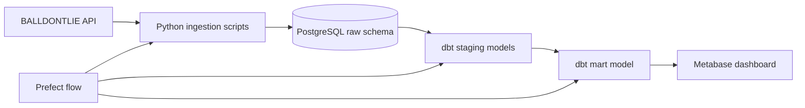
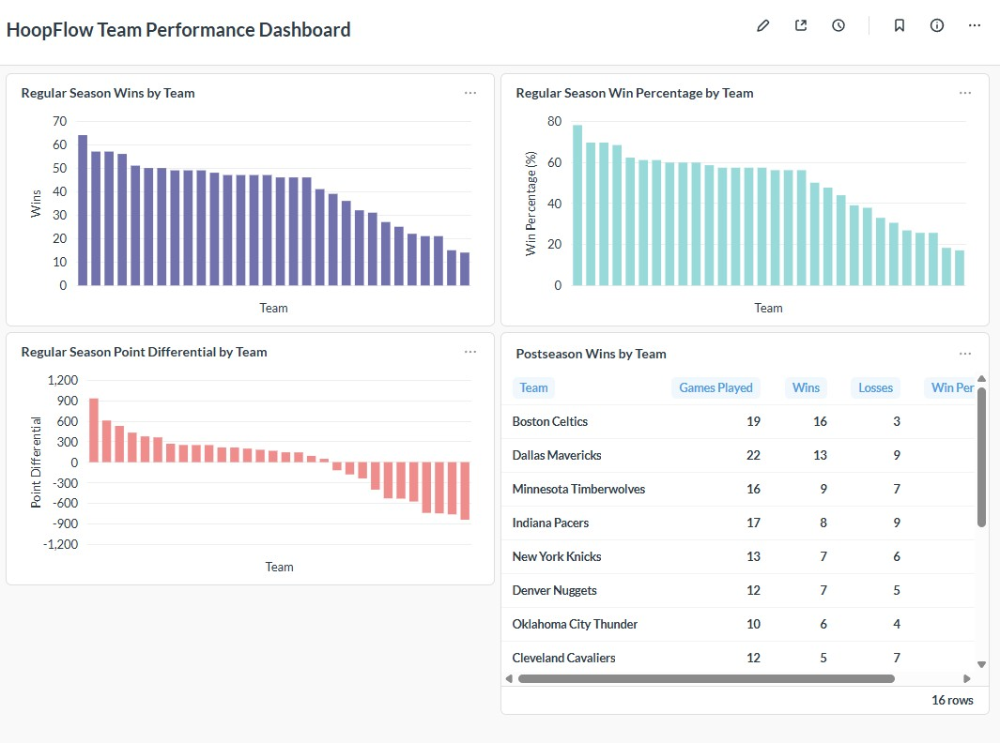

# HoopFlow: Basketball Data Engineering Pipeline

HoopFlow is a beginner-friendly data engineering project that loads NBA team and game data from the BALLDONTLIE API, stores it in PostgreSQL, transforms it with dbt, orchestrates the workflow with Prefect, and visualizes the final mart in Metabase.

The project focuses on the 2023-24 NBA season and separates regular-season and postseason performance while excluding play-in games.

## Project Overview

HoopFlow answers a simple analytics question: how did each NBA team perform across the regular season and postseason?

The final analytics table is `marts.team_season_phase_summary`, with one row per team, season, and season phase.

## Architecture



## Tech Stack

- Python for API extraction and loading
- PostgreSQL in Docker for local storage
- dbt for SQL transformations and tests
- Prefect for local orchestration
- Metabase for dashboarding
- Docker Compose for local services

## Data Pipeline Flow

1. Python ingestion scripts fetch teams and games from the BALLDONTLIE API.
2. The scripts load data into PostgreSQL raw tables.
3. dbt builds staging models from the raw tables.
4. dbt builds the mart model used for analytics.
5. Metabase reads from the mart layer for dashboard visuals.
6. Prefect coordinates the local pipeline commands.

## Database Layers

- Raw: `raw.teams`, `raw.games`
- Staging: `staging.stg_teams`, `staging.stg_games`
- Mart: `marts.team_season_phase_summary`

The mart summarizes games by team, season, and `season_phase`, where `season_phase` is either `regular_season` or `postseason`.

## Data Quality Checks

The project includes 29 dbt tests covering:

- staging model null checks
- staging model accepted values
- team and game primary keys
- relationships between games and teams
- mart-level null checks
- mart grain validation
- regular-season 82-game validation

These checks help confirm that the transformed data is consistent enough for the dashboard.

## Orchestration

The Prefect flow lives at:

```text
src/flows/run_pipeline.py
```

By default, the pipeline skips raw API ingestion and only runs dbt:

```bash
python src/flows/run_pipeline.py
```

For a full refresh, including API ingestion:

```bash
python src/flows/run_pipeline.py --refresh-raw
```

## Dashboard

The Metabase dashboard is built from `marts.team_season_phase_summary`, not from raw data.

It includes views for:

- regular-season wins by team
- regular-season win percentage by team
- regular-season point differential by team
- postseason wins by team



## How To Run Locally

1. Create a `.env` file with PostgreSQL settings and `BALLDONTLIE_API_KEY`.
2. Start PostgreSQL and Metabase:

```bash
docker compose up -d
```

3. Install Python dependencies:

```bash
pip install -r requirements.txt
```

4. Run the default pipeline:

```bash
python src/flows/run_pipeline.py
```

5. To refresh raw API data before dbt:

```bash
python src/flows/run_pipeline.py --refresh-raw
```

6. Open Metabase locally:

```text
http://localhost:3000
```

## Final Project Summary

HoopFlow demonstrates a complete local analytics workflow: API ingestion, Dockerized PostgreSQL storage, dbt transformations, dbt data tests, Prefect orchestration, and a Metabase dashboard. It is intentionally scoped to the 2023-24 NBA season and built as a clear portfolio project rather than a production deployment.
